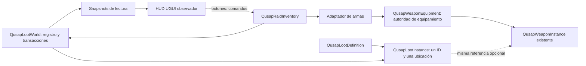
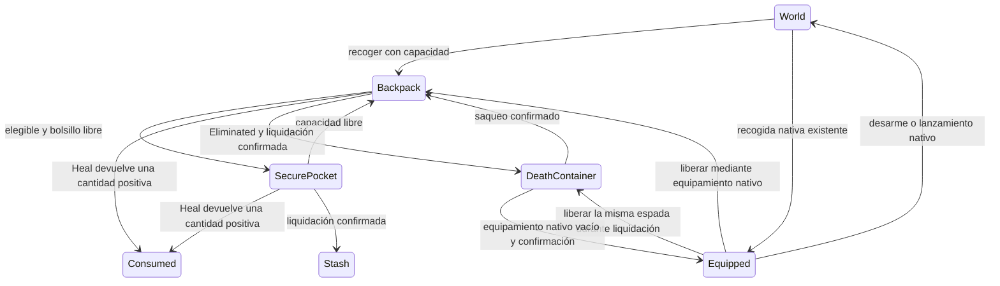

# Inventario de incursión, bolsillo seguro y contenedor de muerte

Primer vertical slice aislado sobre `a9739b28290b6ae60cbc593dc58631984720cb65`, rama `feat/raid-inventory-secure-pocket`. Escena: `Assets/_Qusap/Scenes/RaidInventoryPlayground.unity`.

## Autoridad y ubicaciones

`QusapLootWorld` mantiene un registro único por incursión. Cada instancia tiene un ID de loot, un ID de definición, incursión, procedencia y exactamente una ubicación/tenedor/índice. Los snapshots son vistas de lectura; el inventario, los pickups, el contenedor y el HUD no mantienen listas de propiedad adicionales.

`Equipped` es una proyección en el registro del arma que devuelve `QusapWeaponEquipment.EquippedWeapon`; nunca es otro slot de equipamiento. El adaptador no copia `OwnerEntityId`, no crea espadas y conserva la referencia y el `InstanceId` nativos. Los SO de espada resuelven sus definiciones mediante el catálogo existente y el ID; no duplican daño, ataques o presentación.

## Transacciones y muerte

La mochila tiene capacidad serializada, seis slots por defecto, sin peso ni stacking. El bolsillo tiene un slot. Rechaza armas, armaduras, cuernos y objetivos incluso si se activa la bandera de elegibilidad. Las operaciones validan origen, disponibilidad y destino; reservan antes de confirmar y notifican después de transferir. Un rechazo conserva la instancia en su origen. Una curación sin efecto conserva el consumible; `Heal` efectivo precede al cambio a `Consumed`.

El componente bloquea comandos desde `HealthDepleted` y también consulta el estado del receptor en cada comando. Liquida únicamente desde `Eliminated`, después de la eliminación terminal del gameplay. El contenedor tiene la clave `RaidId/death/ParticipantId` y un snapshot inicial inmutable de lo transferido; su contenido actual se lee del registro. La mochila y el arma efectivamente equipada pasan al contenedor; el bolsillo pasa al stash. Una espada ya desarmada o lanzada conserva la ruta nativa del mundo. La liquidación repetida devuelve el resultado confirmado y no genera otro contenedor ni otro evento.

El registro utiliza exclusión mutua y reservas por instancia, además de una protección contra reentrada de liquidación. Dos reclamaciones concurrentes tienen un único ganador. El stash se confirma antes de mover las ubicaciones. Si el repositorio rechaza o lanza una excepción, la liquidación queda pendiente, la mochila y el bolsillo permanecen en su origen y la espada liberada se restaura mediante el mismo equipamiento nativo. `RetryDeathSettlement` permite reintentar, sin introducir un temporizador.

La recuperación técnica existente a Y < -8 no publica `Eliminated` y no liquida. Conserva vida, mochila, bolsillo y espada. No se cambian movimiento, físicas, colliders de jugadores, InputActions, combate, valores de vida/ataques, animaciones o relojes globales.

## Escena y HUD

La escena nueva reutiliza los dos jugadores, geometría y bootstrap nativo de `CombatPlayground`; añade componentes de inventario, bootstrap de incursión, pickups y HUD UGUI. Conserva el prefab principal como referencia sin aplicarle modificaciones. El HUD anterior se retira únicamente de la copia. La zona ambiental nueva usa los valores predeterminados existentes del componente de daño. Los únicos seis tipos de loot son fragmento, reliquia, curación provisional +25 y las tres espadas existentes; no hay asset de cuerno.

Cada panel muestra mochila, bolsillo, arma, vida, estado, stash y contenido de un contenedor. Los botones seleccionan objetos y envían comandos a las autoridades. El HUD conserva solo selección/presentación y se actualiza mediante eventos. Para equipar la espada de un contenedor se debe liberar la propia usando «Guardar espada en mochila»; esto requiere un slot libre. En este slice el equipamiento de espada guardada en mochila no tiene comando adicional. Se selecciona preferentemente un contenedor alcanzable; la elección explícita entre varios contenedores queda para otra interfaz.

## Límites del stash y del mapa

`IQusapStashRepository` define una confirmación atómica e idempotente. La implementación en memoria registra las mismas instancias, con una clave de liquidación y comprobación de identidad. No usa disco, PlayerPrefs ni red. El bootstrap crea un repositorio por incursión: recargar la escena o cerrar el juego pierde el stash. La interfaz permite inyectar otro repositorio posteriormente, sin afirmar persistencia actual. Un repositorio futuro debe respetar el contrato de «rechazo sin cambios» y confirmar el lote completo; no se simula durabilidad.

La posición de contenedor es la posición válida de muerte en este escenario, con un pequeño desplazamiento vertical. La colocación sobre mapas irregulares, pendientes, agua o vacío se resolverá después. No hay extracción, ganador, cuerno jugable, networking, armaduras, rareza con efectos, menú de stash ni ocho controles. El modelo sí permite ocho inventarios independientes.

## Validación y evidencia

Los tests definitivos están en `QusapRaidInventoryEditModeTests` y `QusapRaidInventoryPlayModeTests`. La validación inicial ejecutó las pruebas afectadas; después de la aprobación visual y funcional se ejecutaron ambas suites completas sin filtros. Todas las ejecuciones usan Unity 6000.5.7f1 y `--burst-disable-compilation`; se vigila Code Integrity y se verifica por SHA-256 la conservación de todos los archivos preexistentes y del frontend.

El builder `QusapRaidInventoryBuilder` y el fixture `QusapRaidInventoryEvidence`, junto con sus dos archivos `.meta`, son cuatro archivos diagnósticos locales excluidos del commit de producción. Los 63 archivos definitivos no tienen dependencias de código ni referencias de assets a estos diagnósticos. El vídeo usa los controles nativos con dispositivos de prueba, pickups y transferencias reales. Los comandos de inventario se orquestan mediante el fixture, sin modificar InputActions. Dos triggers temporales del componente ambiental existente aplican daño y eliminación; una caída explícita a Y=-9 comprueba la recuperación. Si ambos jugadores agotan los pickups de la escena, el fixture instancia un pickup adicional del prefab de producción para comprobar el rechazo por mochila llena. Estos objetos de captura no se guardan en la escena. La evidencia no altera salud, inventario o equipamiento por asignación directa.

La grabación utiliza una copia temporal de la cámara con encuadre fijo para conservar la geometría de píxeles del HUD. La cámara compartida original mantiene su comportamiento. La toma final continua dura 12,067 segundos, con 362 fotogramas a 30 fps; sus comprobaciones registran cero errores y cero warnings de runtime.

Resultados iniciales de las pruebas afectadas:

| Suite | Nuevas de inventario | Regresión de vitalidad | Regresión de lanzamiento/daño de espada | Total aprobado | Fallidas / omitidas / inconclusas |
| --- | ---: | ---: | ---: | ---: | --- |
| EditMode | 20 | 11 | 0 | 31 | 0 / 0 / 0 |
| PlayMode | 13 | 12 | 53 | 78 | 0 / 0 / 0 |

Resultados definitivos de las suites completas sin filtros, después de aprobación:

| Suite | Baseline aprobado | Nuevas de inventario | Total / aprobadas | Fallidas | Omitidas | Inconclusas |
| --- | ---: | ---: | ---: | ---: | ---: | ---: |
| EditMode | 374 | 20 | 394 / 394 | 0 | 0 | 0 |
| PlayMode | 463 | 13 | 476 / 476 | 0 | 0 | 0 |

Los totales coinciden exactamente con el baseline más las 33 pruebas nuevas. Ambas ejecuciones finalizaron con código 0. No hubo errores, excepciones ni warnings nuevos de runtime o compilación respecto a las Consoles completas del baseline. PlayMode conserva cuatro errores intencionados de configuración inválida de input, esperados mediante `LogAssert.Expect` en los tests preexistentes de integración visual de armas; no son fallos ni mensajes nuevos. También conserva los dos avisos preexistentes de P2 sin gamepad y el aviso del editor por Burst desactivado. La comparación y las Consoles completas se conservan en `RaidInventorySecurePocket\FinalSuites` fuera del repositorio.

PlayMode conserva dos avisos de fixtures nativos preexistentes sobre P2 sin gamepad; los fixtures nuevos y la captura emparejan teclado/gamepad. Las Consoles también conservan los mensajes del editor de Burst desactivado y del servicio de licencia. No se ocultan estos mensajes. Los primeros intentos de compilación detectaron usos nuevos de una API obsoleta de búsqueda, corregidos en los archivos nuevos; las ejecuciones finales no tienen warnings de compilación nuevos. Los intentos de captura anteriores se conservan como diagnósticos, con sus incidencias explícitas, y no se usan como evidencia final.

Code Integrity: cero eventos 3077, 3089, 3033 o 3118 nuevos en la validación inicial y durante las suites completas definitivas. No se han cambiado opciones de seguridad, borrado cachés ni añadido excepciones.

Consoles completas, XML, ejecuciones con argumentos, Code Integrity, vídeo, manifest de archivos y auditoría final se guardan fuera del repositorio en `C:\Dev\Qusap_ArtSource_Recovered\RaidInventorySecurePocket`. Los intentos fallidos se conservan por separado para distinguirlos de los resultados finales.
