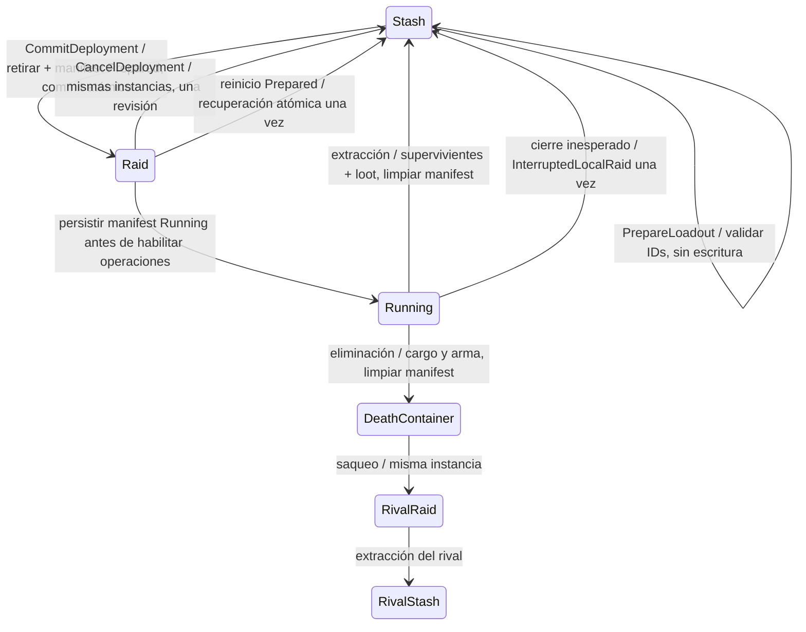

# Raid Loadout + Deployment Foundation

Base: `9d0b6d9e477fc6c537930a402d19941e8f548663`. Rama: `feat/raid-loadout-deployment`.

## Autoridades y propiedad

Se reutilizan el stash persistente, el catálogo aprobado, `QusapLootWorld`, `QusapRaidInventoryState`, el adaptador de armas y los settlements de RaidSession. No hay segundo inventario, catálogo ni slot de equipamiento. La selección guarda IDs y cantidades, no referencias propietarias. El manifiesto es un diario de recuperación en disco; sus DTOs no participan del gameplay ni son otro propietario vivo. Las proyecciones del ledger y del HUD tampoco poseen objetos.

La instancia propia se retira de la autoridad stash antes de importarse al ledger; se conserva el mismo objeto `QusapLootInstance`, su `InstanceId`, `DefinitionId`, procedencia, cantidad e identidad nativa. `QusapWeaponEquipment` sigue siendo el único propietario de una espada equipada. Al guardar una espada, liberar el equipamiento precede al settlement. La ubicación Stash del ledger es una proyección del settlement aprobado, no loot recogible.

## Selección y despliegue

Valores del hito: un arma opcional, hasta dos stacks completos de Consumable, mochila de seis slots y bolsillo inicialmente vacío. `QusapLoadoutLimits` permite configurar cero o un arma y el límite de stacks (hasta la capacidad existente). No se seleccionan Material, Relic, Armor, objetos desconocidos, objetos ajenos, IDs duplicados ni cantidades diferentes del stack existente. No se divide ni fusiona un stack seleccionado.

`PrepareLoadout` valida sin mutación ni escritura. `CommitDeployment` revalida, genera IDs nuevos de despliegue y Raid, comprueba equipamiento vacío y participante disponible, retira la selección y guarda el manifiesto en una sola transacción. Solo después del commit atómico publica las mismas instancias en Raid y equipa la espada. Durante Prepared se bloquean las operaciones del inventario. `StartRunning` persiste el estado antes de habilitarlas. El playground también bloquea el input hasta Running mediante la API existente.

Un fallo de escritura conserva stash, selección, bytes comprometidos e IDs; no entrega objetos ni inicia Raid. Un archivo temporal incompleto se conserva y bloquea nuevas escrituras según la política de FileStore existente. No se borra automáticamente para forzar un retry. La cancelación de un despliegue comprometido Prepared devuelve los objetos en una revisión; repetirla no escribe. Cancelar selección aún no comprometida no necesita persistencia. Running rechaza cancelación y cambios del loadout. La autoridad protege la reentrada durante los callbacks de guardado y el repositorio impide despliegues simultáneos.

## RaidLoaner

Sin arma propia se usa la definición canónica existente `raid_qusap_sword_blue`, resuelta desde el alias directo `raid_basic_sword`. La instancia tiene `RaidLoaner=true` y procedencia `RaidLoaner`; no cambia el asset ni sus metadatos. Su espada nativa usa equipamiento, combate, presentación y animaciones existentes. Puede desarmarse, caer y recogerse durante Raid.

La elegibilidad efectiva de persistencia es `!RaidLoaner && Definition.CanPersistInStash`. Tanto el stash en memoria como la conversión a DTO rechazan un loaner; el codec tampoco admite su procedencia reservada. Nunca entra en bolsillo seguro. Extracción lo excluye de la transferencia, lo consume y retira su identidad nativa. Eliminación puede dejarlo temporalmente en el contenedor; finalizar la sesión lo consume y retira. Las vistas nativas de un arma retirada se eliminan del registro de pickups. Una identidad retirada no puede equiparse otra vez. Los registros consumidos permanecen como tombstones diagnósticos sin propietario.

Dos incursiones generan RaidIds e InstanceIds distintos. No existe venta o sistema económico: un loaner no tiene valor permanente porque no puede cruzar ninguna frontera de persistencia. Una Raid que solo recibe un préstamo no cambia propiedad persistente: no guarda manifest, no escribe y no aumenta Revision. Si selecciona consumibles o adquiere loot, se persisten exclusivamente esas operaciones reales; el préstamo no añade escrituras.

## SchemaVersion 2 y recuperación local provisional

Schema 2 es necesario para recuperar objetos retirados del stash después de un cierre. `ActiveDeploymentManifest` nullable contiene DeploymentId, RaidId, estado Prepared/Running, los DTOs de las instancias seleccionadas (IDs, definiciones, cantidades e identidad nativa), WeaponInstanceId y fecha UTC. RecoveryReason registra la restauración. No contiene loaners, estado físico, GameObjects ni propiedad nativa de equipamiento.

Ambos formatos v1 aprobados se validan con su representación y checksum originales: con Quantity y el formato histórico sin Quantity (cantidad uno). La migración determinista a v2 ocurre en memoria sin escritura al cargar, conservando ProfileId, Revision e identidades. La primera operación real escribe v2. El archivo se sigue llamando `profile-v1.json` por compatibilidad de ruta; el campo SchemaVersion identifica el formato. Producción mantiene exclusivamente `Application.persistentDataPath/Qusap/profile-v1.json`.

FileStore primero valida el documento v2, escribe y flush el `.tmp`, lo relee y valida completamente, comprueba que el principal/backup no cambiaron, y solo entonces realiza el reemplazo atómico. Un v1 principal válido queda como backup tras el primer commit v2; no se reemplaza antes de validar v2. Perfiles corruptos, futuros o temporales huérfanos mantienen el bloqueo de escrituras existente. El checksum detecta corrupción; no ofrece protección antitrampas.

Al cargar Prepared se restauran los objetos seleccionados y se registra `PreparedNotStarted`. Al cargar Running interrumpido se restauran los objetos de la selección original y se registra `InterruptedLocalRaid`. Es un rollback provisional de desarrollo local, incluyendo cantidades originales: el progreso no comprometido de Raid se descarta. Esta política cambiará con autoridad online. La restauración y el borrado del manifest se guardan juntos en una revisión antes de publicar memoria. Si falla, el manifest permanece y bloquea nuevos despliegues. Repetir recuperación o volver a abrir un perfil ya recuperado no duplica objetos ni escribe otra vez.

Extracción devuelve arma propia, cantidades restantes y loot permitido, excluye loaner y limpia manifest en un único settlement/revisión. Consumo agotado no retorna. Eliminación no restaura el loadout: solo protege loot adquirido en bolsillo; el resto pasa al contenedor aprobado. Limpiar manifest sucede cuando el settlement de eliminación ha sido comprometido y la transferencia del ledger queda resuelta, sin permitir comandos reentrantes.

## Escena y validación

`Assets/_Qusap/Scenes/RaidLoadoutDeploymentPlayground.unity` está fuera de Build Settings. Usa los assets aprobados sin modificar prefabs ni escenas de producción. Su bootstrap difiere el inventario hasta Commit; la ruta diagnóstica se inyecta antes de inicializar persistencia y, incluso en Play normal, usa una carpeta temporal aislada. El seed Purple Sword + Minor Heal x2 + Major Heal pertenece solo a esta escena. La ruta diagnóstica nunca sustituye la ruta de producción.

HUD: perfil/schema/revisión, stash, selección y cantidades, dos slots de consumibles, arma/loaner, IDs de despliegue y Raid, estado, ubicación de instancias, escrituras, rechazos, duplicados y préstamos creados/destruidos. Grabador y constructor de evidencia existen exclusivamente en la copia externa de validación y no se serializan en la escena.

El actor heredado incluye `QusapDoubleLStartingWeapon`, un seed visual de arma inicial, sin selección, transacción ni reserva persistente. Sus dos componentes se desactivan exclusivamente mediante overrides de la nueva escena, igual que la generación automática del bootstrap nativo. No se modifica ese componente ni el prefab principal; así solo el despliegue entrega equipamiento en este playground. Teclas T y M alternan los stacks Minor/Major antes del commit.

Las pruebas nuevas cubren selección, límites, categorías, cantidad, no mutación en Prepare, commit y callbacks atómicos, fallos y cancelación, bloqueo Prepared/Running, identidad exacta, consumo parcial/agotado, extracción, eliminación/saqueo, pocket adquirido, política del préstamo, limpieza nativa, IDs nuevos, migración y recuperación idempotente. La finalización tras aprobación visual exige las suites completas EditMode y PlayMode sin filtros. Cada fixture usa un hijo GUID bajo una carpeta temporal de pruebas; jamás el perfil real. No se cambian daño, combos, animaciones, física, movimiento, Root Motion, catálogo ni aliases.

Las verificaciones explícitas de finalización comprueban cancelación previa al commit sin cambiar bytes, revisión, escrituras ni objetos; aliases resueltos inmediatamente al canónico con el mismo InstanceId durante despliegue, extracción y recarga; cantidades consumidas ausentes después de recargar; y el préstamo retirado inaccesible para pickup, bolsillo y equipamiento, rechazado por stash y DTO, ausente del archivo guardado y de la recarga tras cerrar la sesión. `@Consumed` es únicamente un registro terminal en memoria sin propietario, no una instancia persistente. No existe API de venta; las armas no son apilables y el préstamo no tiene valor permanente.
